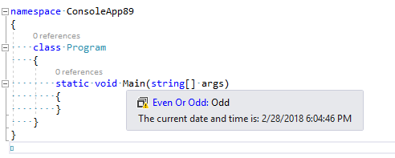
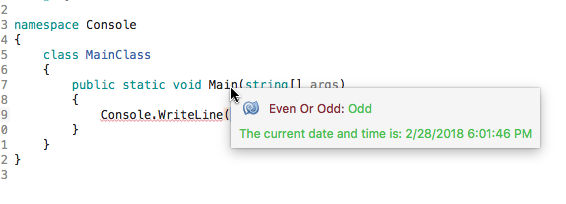
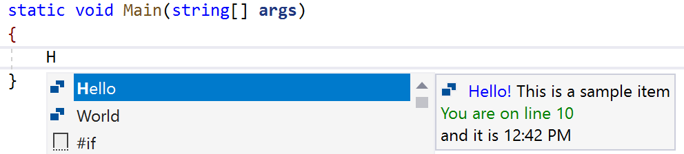
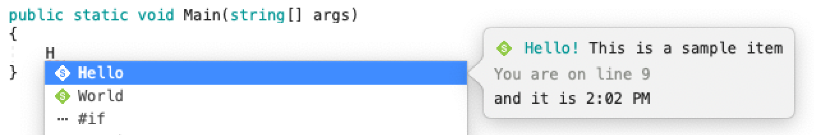

# vs-xplat-extensibility-samples
Unified extensibility samples that work on Visual Studio for Windows and Visual Studio for Mac

## Async Quick Info

Displays a quick info entry on hover indicating the current time and whether the line
is at an even or odd numbered offset.

This project demonstrates code reuse when dual targeting VS for Windows and VS for Mac.

- AsyncQuickInfoDemo: Common binaries built and run on both VS for Windows and VS for Mac.
- AsyncQuickInfoDemo.VSWindows: VS VSIX project that packages AsyncQuickInfoDemo for VS for Windows.
- AsyncQuickInfoDemo.VSMac: VS VSIX project that packages AsyncQuickInfoDemo for VS for Mac.

**Visual Studio for Windows:**

- Requires Visual Studio 2017 15.6 Preview 4 or later
- Requires VS extensibility workload
- Open solution file, select 'Any CPU - Windows' Platform
- Build
- Set 'AsyncQuickInfoDemo.VSWindows' as the startup project.
- Launch VS

**Visual Studio for Mac:**

- Requires Visual Studio for Mac 15.6
- Requires Addin Maker
- From the OS X terminal in the solution directory:
  - run msbuild /t:restore
  - run msbuild /t:build
  - cd AsyncQuickInfoDemo.VSMac
  - run msbuild /t:InstallAddin
  - Launch VS for Mac

## Async Completion

Adds completion items to all C# completion sessions. 
Added items are "Hello", "World" and either "even" or "odd", depending on whether the line is at an even or odd numbered offset.

This project demonstrates code reuse when dual targeting VS for Windows and VS for Mac.

- HelloWorldCompletion: Common binaries built and run on both VS for Windows and VS for Mac.
- HelloWorldCompletion.VSIX: VS extensibility project that packages HelloWorldCompletion for VS for Windows.
- HelloWorldCompletion.Mac: AddIn project that packages HelloWorldCompletion for VS for Mac.

**Visual Studio for Windows:**

- Requires Visual Studio 2019
- Requires VS extensibility workload
- Open solution file, select 'Any CPU - Windows' Platform
- Build
- Set 'HelloWorldCompletion.VSIX' as the startup project.
- Launch VS and open C# file

**Visual Studio for Mac:**

- Requires Visual Studio for Mac 15.7
- Requires Addin Maker
- Open solution file, build
- Run 'HelloWorldCompletion.Mac'
- Open C# file
